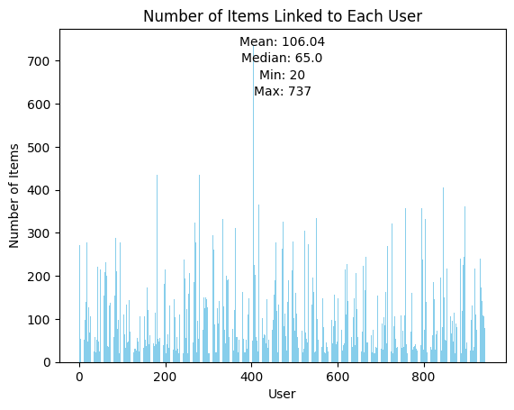

# Final Report

## Data exploration

## Solution exploration

Nomenclature and overview:

- Explicit feedback
- Implicit feedback
- GNN
    <!-- - user-to-item bipartite graph -->
- Content-Based approaches
    <!-- - similarities between items -->
- Collaborative Filtering Approaches
    <!-- - similarities between users -->
- Hybrid Approaches
    <!-- - LightFM -->
- Matrix Factorization
    - latent factors
    <!-- - latent factor model -->
- GNN vs Matrix Factorization
    - GNN are able to aggregate multi-hop neighborhoods 
    - Matrix representation use only direct connections
- Supervised learning on graphs
    - Labels come from external sources (predict ratings of an interaction)
    - RMSE loss
- Self-supervised learning on graphs
    - Signals come from graphs themselves (predict if two nodes are connected)
    - BPR (Bayesian Personalized Ranking) loss
<!-- - GNN learning
    - preprocess the data and construct the graph
    - rating above 3.5 is considered as an edge -->
- Graph representation
    - Adjacency matrix 
    - COO format - a memory efficient approach to store sparse matrices 
- Adjacency matrix from bipartite graph

Two approaches that we can consider for the task

- Collaborative filtering using matrix factorization
- GNN using LightGCN

### GNN (LightGCN)

Loss: $$\text{RMSE} = \sqrt{\dfrac{1}{n}\sum_{i=1}^{n}{(y_i - \hat{y})^2}}$$

## Training process 

## Evaluation